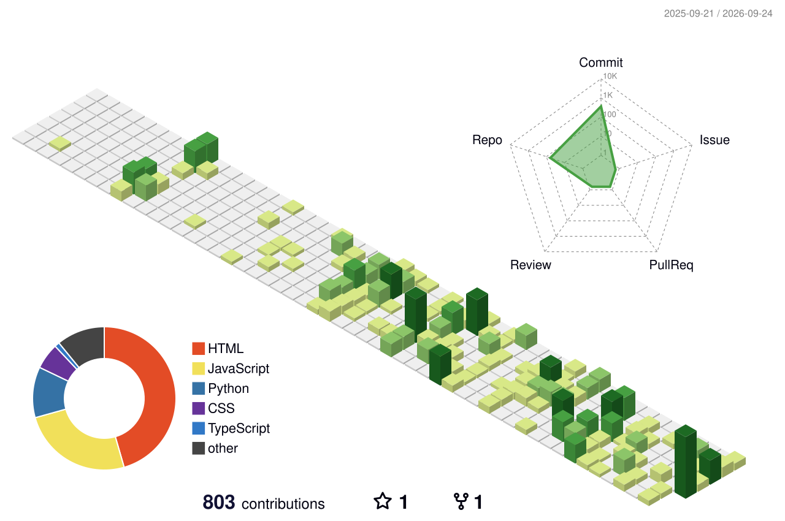

# Arjunren Von

**Software & Network Engineer • Ethical Hacker • Photographer**

`Software Engineering` • `AI` • `Cloud` • `Cybersecurity` • `Networking`

---

## About Me

I'm a multidisciplinary **Software Engineer, Network Engineer, and Ethical Hacker** focused on building secure end-to-end systems. My work spans Python and JavaScript development, computer-vision interfaces, IoT telemetry, network infrastructure, automation, and security-focused software—including systems designed to protect digital assets.

Outside engineering, photography is one of my main creative interests. I enjoy combining technical problem-solving with visual creativity and building practical tools that people can actually use.

---

## Verified by Industry-Leading Platforms

<table>
<tr>
<td width="25%" align="center"><a href="https://www.harvard.edu"> <b>Harvard University</b></a></td>
<td width="25%" align="center"><a href="https://opswatacademy.com/"> <b>OPSWAT Academy</b></a></td>
<td width="25%" align="center"><a href="https://appkademiya.online/"> <b>Appkademiya</b></a></td>
<td width="25%" align="center"><a href="https://www.apisecuniversity.com/"> <b>APIsec University</b></a></td>
</tr>
<tr>
<td align="center"><a href="https://www.coursera.org/"> <b>Coursera</b></a></td>
<td align="center"><a href="https://www.udemy.com/"><b>Udemy</b></a></td>
<td align="center"><a href="https://www.edx.org/"> <b>edX</b></a></td>
<td align="center"><a href="https://freeacademy.ai/"> <b>FreeAcademy.ai</b></a></td>
</tr>
<tr>
<td align="center"><a href="https://hackandfix.com/"> <b>Hack&amp;Fix</b></a></td>
<td align="center"><a href="https://www.freecodecamp.org/"><b>FreeCodeCamp</b></a></td>
<td align="center"><a href="https://hackviser.com/"> <b>HackViser</b></a></td>
<td align="center"><a href="https://www.cisco.com/"><b>Cisco</b></a></td>
</tr>
<tr>
<td align="center"><a href="https://www.offsec.com/"> <b>OffSec</b></a></td>
<td align="center"><a href="https://dict.gov.ph/"> <b>DICT</b></a></td>
<td align="center"><a href="https://www.datacamp.com/"><b>DataCamp</b></a></td>
<td align="center"><a href="https://www.codecademy.com/"> <b>Codecademy</b></a></td>
</tr>
</table>

---

## Core Tech Stack

  
  
  
  
  
  
  
  
  
  
  
  
  
  
  
  
  
  
  
  
  
  
  
  
  
  
  
  

Each badge links to the official project or documentation site.

---

## Featured Projects

These are my current pinned GitHub repositories.

| Project | What it does | Main technology |
|---|---|---|
| [**Jarvis_V1**](https://github.com/Arjunren/Jarvis_V1) | Voice-activated Windows AI assistant with speech recognition, text-to-speech, app/system controls, web actions, media controls, a pygame interface, and automated tests. | Python |
| [**CyberRangeDesktopLab**](https://github.com/Arjunren/CyberRangeDesktopLab) | Local-first defensive cybersecurity training desktop app with guided courses, safe simulations, quizzes, CTF-style challenges, progress tracking, instructor tools, audit logs, and PDF certificates. | Java / JavaFX |
| [**Digital_Asset_Management**](https://github.com/Arjunren/Digital_Asset_Management) | Native digital-asset library for local XAMPP use with secure uploads, metadata/search, RBAC, previews, version history, sharing, collections, reporting, audit logs, and recycle-bin workflows. | PHP 8 / MySQL |
| [**OpenPresenter**](https://github.com/Arjunren/OpenPresenter) | Open-source browser application for opening and presenting `.pptx` files without requiring Microsoft PowerPoint, LibreOffice, or a server-side conversion service. | TypeScript |
| [**Programming_Exam_Platform**](https://github.com/Arjunren/Programming_Exam_Platform) | Secure-by-design WPF foundation for academic programming exams with SQLite persistence, authentication/lockout, dashboards, examinations, audit logs, grading primitives, timer logic, and a fail-closed execution boundary. | C# / WPF |
| [**Table_Management_System**](https://github.com/Arjunren/Table_Management_System) | Full-stack restaurant table-management system with dynamic floorplan editing, real-time table operations, receipt generation, MySQL-backed data handling, and deployment automation. | Python / Flask / MySQL |

---

## GitHub Contributions

  <a href="https://github.com/Arjunren">
    <picture>
      <source media="(prefers-color-scheme: dark)" srcset="./profile-3d-contrib/profile-night-rainbow.svg">
      
    </picture>
  </a>

Automatically regenerated by GitHub Actions from my GitHub contribution activity.

---

## GitHub Statistics

  <picture>
    <source media="(prefers-color-scheme: dark)" srcset="https://github-stats-extended.vercel.app/api?username=Arjunren&show_icons=true&hide_rank=true&theme=dark">
    
  </picture>
  <picture>
    <source media="(prefers-color-scheme: dark)" srcset="https://github-stats-extended.vercel.app/api/top-langs/?username=Arjunren&layout=compact&langs_count=8&theme=dark">
    
  </picture>

  <picture>
    <source media="(prefers-color-scheme: dark)" srcset="https://streak-stats.demolab.com/?user=Arjunren&theme=dark&hide_border=true">
    
  </picture>

Language cards reflect language usage in public, non-forked repositories; they are not a measure of proficiency.

---

## Certificates & Credentials

<table>
<tr>
<td width="50%" align="center" valign="top">
 
<b>CS50's Introduction to Programming with Python</b> Harvard University
</td>
<td width="50%" align="center" valign="top">
 
<b>Certified Web Penetration Tester (CWPT)</b> Appkademiya
</td>
</tr>
<tr>
<td align="center" valign="top">
 
<b>Critical Infrastructure Protection (CIP)</b> OPSWAT Academy
</td>
<td align="center" valign="top">
 
<b>NetOps Certified Engineer (NetOps)</b> Appkademiya
</td>
</tr>
<tr>
<td align="center" valign="top">
 
<b>Certified IT Support Specialist</b> Appkademiya
</td>
<td align="center" valign="top">
 
<b>Certified Cybersecurity Professional (CCP)</b> Appkademiya
</td>
</tr>
<tr>
<td align="center" valign="top">
 
<b>API Security Authentication</b> APIsec University
</td>
<td align="center" valign="top">
 
<b>OWASP API Security Top 10</b> APIsec University
</td>
</tr>
</table>

---

## Experience

| Period | Role | Organization / Milestone |
|---|---|---|
| **2025 – Present** | Software Engineer Lead | BigBoys Automation |
| **2024** | Senior Software Developer | BigBoys Automation |
| **2024** | Junior Software Developer | BigBoys Automation |
| **2023** | Technical IT Support | Datatelcom System Communication |
| **2022** | Hello World! | Wrote my first line of code in Java |

---

<b>View Complete Technical Stack</b>

 

- **Frontend:** HTML, CSS, Tailwind CSS, Bootstrap, JavaScript, TypeScript, React.js, Next.js, Vue.js, Angular
- **Backend:** Java, Python, Node.js, FastAPI, Django, PHP, Go, Rust, C#, .NET MAUI, Spring Boot, GraphQL, Supabase, PostgreSQL, MongoDB, Redis
- **Design:** Figma, Photoshop, Illustrator, Adobe XD, Canva
- **DevOps & Cloud:** AWS, Azure, Docker, Terraform, Ansible, Kubernetes, GitHub Actions, GitLab CI/CD, Jenkins, CircleCI, Vagrant, Prometheus, Grafana
- **Data & AI:** Kaggle, Roboflow, OpenCV, PyTorch, TensorFlow, Pandas, NumPy
- **Automation:** n8n, Selenium, Playwright, Bash, PowerShell
- **Cybersecurity & Pentesting:** Nmap, Wireshark, Burp Suite, Metasploit, Aircrack-ng, SQLMap, Hydra, John the Ripper, Hashcat, OWASP ZAP, Nessus, Snort, Splunk, Ghidra, Maltego, Kismet, Radare2, YARA, Suricata, Zeek, Gobuster, Nikto, Dirb
- **Operating Systems:** Kali Linux, Parrot OS, Windows, Ubuntu Server, RHEL, CentOS, Debian
- **Virtualization:** VMware, VirtualBox, Proxmox, Hyper-V, KVM
- **Hosting & Deployment:** Vercel, Netlify, PythonAnywhere, Hostinger, Render, Railway, DigitalOcean, Heroku
- **Developer Tools:** VS Code, Visual Studio, Git, Android Studio, XAMPP, Arduino, MySQL, Swagger, PySide6, PyInstaller, Postman, Webpack
- **Networking:** Packet Tracer, TP-Link, Network Switch, Optic Fiber, Fortinet, MikroTik, Ruijie, DrayTek, Ubiquiti, Reyee, pfSense, Cisco IOS, OSPF, BGP, Palo Alto, EVE-NG, GNS3
- **PABX & Telephony:** Yeastar, NEC, Shenou
- **CCTV & Surveillance:** Hikvision, Dahua
- **Hardware & IoT:** Local Server, Raspberry Pi, ESP32, Arduino Uno, HX711

---

## Open Source & Collaboration

You're welcome to explore my public repositories, report reproducible issues, suggest improvements, and submit contributions to projects that accept them. Contribution rules and project scope may vary by repository, so check each project's README, issue tracker, and contribution guidance first.

---

### Arjunren Von

[Portfolio](https://arjunrenvon.vercel.app/) • [GitHub](https://github.com/Arjunren) • [LinkedIn](https://www.linkedin.com/in/arjunren-von-valdez-37399b370/)

**Building software, systems, and tools one project at a time.**

